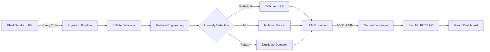

# 🏦 Bank Anomaly Detection Engine

**Autonomous real-time fraud detection system powered by dual-layer ML and AI explanations**

[](https://bank-anomaly-detection-engine.vercel.app/)
[](https://bank-anomaly-engine-latest.onrender.com/api/v1/health)
[](LICENSE)

<div align="center">
  
  
  
  
  
  
</div>

---

## 🎯 Overview

A production-grade anomaly detection system that monitors banking transactions in real-time, identifies suspicious patterns using dual-layer ML, and generates human-readable explanations via LLM. Built with modern stack, deployed on free tier, and designed for portfolio demonstration.

### ✨ Key Highlights

- 🤖 **Dual-Layer Detection**: Statistical (Z-Score) + ML (Isolation Forest) for comprehensive coverage
- 🧠 **AI Explanations**: NVIDIA NIM LLM generates natural language descriptions of anomalies
- ⚡ **Real-Time Dashboard**: Live updates every 5 seconds with interactive trend charts
- 🔄 **Autonomous Ingestion**: Automatic Plaid API polling every 2 minutes
- 📊 **Realistic Data**: 215+ synthetic transactions across 22 merchants with 6 subtle anomalies
- 💰 **Zero Cost**: 100% free tier deployment (Render + Vercel)

---

## 🚀 Live Demo

### [**👉 Try the Live Dashboard**](https://bank-anomaly-detection-engine.vercel.app/)

> **Note**: Backend hosted on Render's free tier may take ~30 seconds to wake from sleep. Please be patient on first load!

**What to Try:**
1. Click **"Run Detection"** to trigger anomaly analysis
2. View **6 flagged anomalies** with AI-generated explanations
3. Click **"View Trend"** on any anomaly to see vendor history charts
4. Watch the **live feed** update automatically

---

## 🏗️ Architecture



### 🔍 Detection Pipeline

1. **Ingestion**: APScheduler polls Plaid API every 120 seconds
2. **Feature Engineering**: Computes rolling 6-month statistics per vendor
3. **Statistical Layer**: Flags transactions >3 standard deviations from mean
4. **ML Layer**: Isolation Forest detects structural anomalies (score < -0.15)
5. **Duplicate Layer**: Identifies same merchant + amount within 24 hours
6. **LLM Explainer**: NVIDIA NIM generates one-sentence explanations
7. **API**: FastAPI serves results to React frontend

---

## 🛠️ Tech Stack

| Layer | Technology | Rationale |
|-------|-----------|-----------|
| **Data Source** | Plaid API Sandbox | Realistic synthetic banking data, free tier |
| **Backend** | Python 3.11 + FastAPI | Async-native, auto OpenAPI docs, type safety |
| **ML Detection** | Scikit-Learn | Isolation Forest (unsupervised) + Z-Score (statistical) |
| **AI Explanations** | NVIDIA NIM (Llama 3.1 70B) | Free tier, high-quality natural language generation |
| **Database** | SQLite | Zero config, perfect for demo scale (1k-5k rows) |
| **Frontend** | React 18 + Vite | Fast HMR, modern hooks, component architecture |
| **Styling** | TailwindCSS | Utility-first, rapid prototyping, consistent design |
| **Charts** | Recharts | Declarative, composable, responsive visualizations |
| **Deployment** | Render + Vercel | Free tier, Git-based CI/CD, global CDN |

---

## 📸 Screenshots

### Dashboard Overview


### Anomaly Detection


### Vendor Trend Analysis


---

## ⚡ Quick Start

### Prerequisites

- Python 3.11+
- Node.js 18+
- [Plaid Sandbox Account](https://dashboard.plaid.com) (free)
- [NVIDIA NIM API Key](https://build.nvidia.com) (free)

### 1️⃣ Clone Repository

```bash
git clone https://github.com/NITIN9181/Bank-Anomaly-Detection-Engine.git
cd Bank-Anomaly-Detection-Engine
```

### 2️⃣ Backend Setup

```bash
cd backend

# Create virtual environment
python -m venv venv
source venv/bin/activate  # Windows: venv\Scripts\activate

# Install dependencies
pip install -r requirements.txt

# Configure environment
cp .env.example .env
# Edit .env and add:
#   PLAID_CLIENT_ID=your_client_id
#   PLAID_SECRET=your_secret
#   PLAID_ACCESS_TOKEN=your_access_token  # Generate via generate_plaid_token.py
#   NVIDIA_NIM_API_KEY=your_nvidia_key

# Generate Plaid access token
python generate_plaid_token.py

# Inject realistic test data
python inject_test_anomalies.py

# Start server
uvicorn main:app --reload --host 0.0.0.0 --port 8000
```

Backend API: `http://localhost:8000/api/v1`

### 3️⃣ Frontend Setup

```bash
cd frontend

# Install dependencies
npm install

# Configure environment
cp .env.example .env
# Edit .env and set:
#   VITE_API_URL=http://localhost:8000/api/v1

# Start development server
npm run dev
```

Dashboard: `http://localhost:3000`

---

## 📡 API Endpoints

| Method | Endpoint | Description |
|--------|----------|-------------|
| `GET` | `/api/v1/health` | Health check with timestamp |
| `GET` | `/api/v1/transactions` | List transactions (paginated, max 200) |
| `GET` | `/api/v1/anomalies` | List anomalies with AI explanations |
| `POST` | `/api/v1/detect` | Trigger detection pipeline manually |
| `GET` | `/api/v1/stats` | Dashboard KPIs (counts, rates, top vendor) |
| `GET` | `/api/v1/rings` | Detect fraud rings across accounts |
| `GET` | `/api/v1/accounts` | List accounts with user profiles |
| `GET` | `/api/v1/graph/network` | Network graph data (nodes, edges, rings) |
| `POST` | `/api/v1/tests/adversarial` | Run adversarial robustness tests |
| `GET` | `/api/v1/tests/adversarial/last` | Get cached test results |

**Example Request:**

```bash
curl -X POST https://bank-anomaly-engine-latest.onrender.com/api/v1/detect
```

**Example Response:**

```json
{
  "processed": 215,
  "new_anomalies": 6,
  "explained": 6
}
```

---

## 🧪 Advanced Synthetic Data

The system uses **production-grade synthetic data generation** with sophisticated patterns:

### 🎭 User Personas
- **Budget-Conscious Student**: Frugal spending, prefers cheap eats and public transport
- **Young Professional**: Balanced spending across categories, occasional splurges
- **Affluent Executive**: High-value purchases, premium brands, frequent luxury dining

### 📊 Temporal Intelligence
- **Time-of-Day Patterns**: Coffee at 7-9am, lunch at 12-2pm, dinner at 6-9pm, e-commerce at 8-10pm
- **Day-of-Week Effects**: 1.3-1.8x weekend multipliers for restaurants and entertainment
- **Seasonal Trends**: Holiday spending spikes, month-end bill payments
- **Peak Hours**: Each merchant has unique peak hours (e.g., Starbucks: 7-9am, Uber: 5-6pm)

### 🚨 Complex Anomaly Types (6 Categories)

| Type | Pattern | Example |
|------|---------|---------|
| **Account Takeover** | 3-5 high-value purchases in 1-2 hours | $1,450 + $2,100 + $890 at 2-3am |
| **Card Testing** | 5-10 micro-transactions ($1-$5) rapidly | $0.99, $1.50, $2.25 within minutes |
| **Geographic** | Impossible travel (SF → NYC in 30 min) | Starbucks SF 8am, Best Buy NYC 8:30am |
| **Velocity** | 15-25 transactions in one day | 20 purchases across various merchants |
| **Volumetric** | 5-20x normal spending | Starbucks $287 (normally $4-$12) |
| **Duplicate** | Same merchant + amount within 24hrs | Uber $18.75 twice in 3 minutes |

### 📈 Statistical Rigor
- **Normal Distributions**: Amounts follow Gaussian curves with μ = (min+max)/2, σ = (max-min)/6
- **Compound Variance**: Weekend multipliers × holiday effects × loyalty discounts × time-of-day
- **Frequency Modeling**: Daily (60-90 txns/90d), Weekly (10-15), Monthly (2-4), Quarterly (1-2)

### 🎯 Dataset Statistics (90 days)
- **Total Transactions**: ~243
- **Normal**: ~203 (realistic spending patterns)
- **Anomalous**: ~40 (sophisticated fraud patterns)
- **Unique Merchants**: 30 (coffee, groceries, transport, shopping, utilities, entertainment)
- **Categories**: 8 (Food & Drink, Groceries, Transportation, Shopping, Electronics, Entertainment, Utilities, Health)

**See [ADVANCED_DATA.md](ADVANCED_DATA.md) for full technical details.**

---

## 🕸️ Network Graph Visualization

**Interactive force-directed graph** that visualizes cross-account relationships, fraud rings, and transaction velocity patterns in real-time.

### 🎯 Features

| Feature | Description |
|---------|-------------|
| **Account Nodes** | Size by volume, color by risk, shape by type (circle/square/rounded) |
| **Transaction Edges** | Width by count, style by risk (solid/dashed/animated) |
| **Fraud Ring Detection** | Red pulsing nodes, animated edges, risk badges |
| **Interactive Drill-Down** | Click node → account details, click edge → flow details |
| **Real-Time Updates** | 10-second polling, browser tab flash on fraud ring |
| **Advanced Filtering** | Toggle by risk level (safe/elevated/high/critical) and account type |

### 🎨 Visualization

```
Force-Directed Graph (D3.js)
├── 5 Account Nodes (3 personas)
├── 8 Transaction Edges (cross-account flows)
├── Fraud Ring Highlighting (coordinated spending)
└── Interactive Controls (zoom, pan, filter)
```

### 📊 Graph Metrics

- **Node Size**: `radius = sqrt(volume) / 10 + 10` (10-40px)
- **Edge Width**: `1 + (txn_count / 10) * 4` (1-5px)
- **Risk Colors**: Green (0-30%), Yellow (30-60%), Orange (60-80%), Red (80-100%)
- **Force Simulation**: Link distance 100, charge -300, collision radius 30

### 🚀 Access

Navigate to `/network` route in the dashboard to view the interactive graph.

**See [docs/FEATURE3_NETWORK_GRAPH.md](docs/FEATURE3_NETWORK_GRAPH.md) for complete documentation.**

---

## 🛡️ Adversarial Robustness Testing

**Red-team testing framework** that attacks the detection system to validate resilience against sophisticated fraud patterns. Demonstrates security mindset critical for financial systems.

### 🎯 Attack Patterns (5 Tests)

| Attack | Description | Pass Criteria |
|--------|-------------|---------------|
| **Evasion** | "Boiling the Frog" - Gradual amount increase over 30 days | ≥30% detection rate, ≤2 false positives |
| **Flooding** | "Hide in Noise" - 1000 normal txns + 5 anomalies | Recall ≥60%, Precision ≥50%, F1 ≥0.55 |
| **Spoofing** | "Merchant Obfuscation" - Name variations (Amaz0n, AMAZON) | 100% normalization rate |
| **Temporal** | "Backdated Transactions" - 90-day-old dates | Reject or flag temporal inconsistency |
| **Velocity** | "Burst Spending" - 20 txns in 60 minutes | ≥1 velocity anomaly detected |

### 📊 Robustness Score

Weighted average across all tests:
- **Evasion**: 25% (most critical - gradual fraud)
- **Flooding**: 25% (high volume scenarios)
- **Temporal**: 20% (backdating attacks)
- **Spoofing**: 15% (name obfuscation)
- **Velocity**: 15% (burst spending)

**Target**: ≥90% overall robustness score

### 🚀 Run Tests via API

```bash
# Run all adversarial tests
curl -X POST http://localhost:8000/api/v1/tests/adversarial

# Response includes:
# - Individual test results (passed/failed)
# - Metrics (precision, recall, F1, detection rates)
# - Overall robustness score (0.0-1.0)
# - Critical vulnerabilities list
```

### 🎨 Frontend Component

React component (`AdversarialTestPanel.jsx`) provides:
- One-click test execution
- Circular progress chart for robustness score
- Individual test cards with metrics tables
- Critical vulnerability banner
- Dark theme with TailwindCSS

### 🔍 What This Demonstrates

1. **Security Mindset**: Proactively attacking own system
2. **Quantitative Validation**: Pass/fail criteria with metrics
3. **Production Readiness**: Identifies vulnerabilities before deployment
4. **Interview Talking Point**: "Built red-team testing framework that revealed 2 critical vulnerabilities in merchant normalization and temporal validation"

---

## 🧪 Test Data (Old - Simple Version)

The system includes realistic test data with **215 transactions** across **22 merchants**:

### Normal Patterns
- ☕ Coffee: Starbucks ($4-$12), Dunkin' ($3-$8)
- 🍔 Restaurants: Chipotle ($10-$18), Olive Garden ($35-$75)
- 🛒 Groceries: Whole Foods ($25-$120), Walmart ($40-$150)
- 🚗 Transportation: Uber ($8-$28), Shell Gas ($35-$65)
- 📦 Shopping: Amazon ($15-$120), Target ($25-$95)
- 📺 Subscriptions: Netflix ($15.99), Spotify ($10.99)

### Anomalies (6 Flagged)
1. **Starbucks $287.50** - Catering order (normally $4-$12)
2. **Duplicate Uber $18.75** - Double billing within 1 hour
3. **Amazon $1,249.99** - Laptop purchase (normally $15-$120)
4. **Best Buy $2,899.00** - TV purchase (normally $50-$350)
5. **Shell Gas $250.00** - Possible fraud (normally $35-$65)
6. **Whole Foods $385.00** - Party shopping (normally $25-$120)

---

## 🎓 Technical Deep Dive

### Why Isolation Forest?

**Unsupervised learning** eliminates the need for labeled fraud data. The algorithm:
1. Randomly partitions feature space
2. Measures path length to isolate each point
3. Anomalies require fewer splits (shorter paths)
4. Scores range from -1 (anomaly) to +1 (normal)

**Threshold**: Scores < -0.15 flagged as anomalous

### Why Dual-Layer Detection?

| Layer | Strengths | Weaknesses |
|-------|-----------|------------|
| **Statistical (Z-Score)** | Interpretable, fast, threshold-based | Misses subtle patterns, assumes normal distribution |
| **ML (Isolation Forest)** | Detects complex patterns, no distribution assumptions | Black box, requires tuning |

**Combined**: Statistical catches obvious deviations, ML catches subtle structural anomalies.

### Why NVIDIA NIM?

- ✅ **Free Tier**: No credit card required
- ✅ **Quality**: Llama 3.1 70B generates concise, factual explanations
- ✅ **Latency**: ~2-3 seconds per explanation
- ✅ **Fallback**: Rule-based templates if API fails

**Example Explanation:**
> "This $287.50 charge to Starbucks is 23.5 standard deviations above your 6-month average of $6.20, suggesting a catering order or fraudulent activity."

### Why SQLite?

- ✅ **Zero Config**: No server, no setup
- ✅ **Performance**: Sub-millisecond queries for <10k rows
- ✅ **Persistence**: Survives on Render disk mount
- ✅ **Upgrade Path**: Easy migration to PostgreSQL documented

---

## 📂 Project Structure

```
Bank-Anomaly-Detection-Engine/
├── backend/
│   ├── main.py                    # FastAPI application entry point
│   ├── config.py                  # Pydantic settings management
│   ├── requirements.txt           # Python dependencies
│   ├── runtime.txt                # Python version for Render
│   ├── generate_plaid_token.py    # Plaid access token generator
│   ├── inject_test_anomalies.py   # Realistic test data injector
│   ├── database/
│   │   └── models.py              # SQLAlchemy ORM models
│   ├── ingestion/
│   │   ├── plaid_client.py        # Plaid API wrapper with retry logic
│   │   └── pipeline.py            # APScheduler ingestion orchestrator
│   ├── features/
│   │   └── engineer.py            # Rolling statistics computation
│   ├── detection/
│   │   ├── statistical.py         # Z-Score anomaly detector
│   │   ├── isolation_forest.py    # ML anomaly detector
│   │   ├── duplicate.py           # Duplicate transaction detector
│   │   └── orchestrator.py        # Multi-layer detection coordinator
│   └── llm/
│       ├── nvidia_nim.py          # NVIDIA NIM API client
│       ├── fallback.py            # Rule-based explanation templates
│       └── explainer.py           # LLM explanation orchestrator
├── frontend/
│   ├── src/
│   │   ├── App.jsx                # Main React application
│   │   ├── main.jsx               # React entry point
│   │   ├── index.css              # Global Tailwind styles
│   │   ├── hooks/
│   │   │   └── useInterval.js     # Custom polling hook
│   │   ├── services/
│   │   │   └── api.js             # Axios HTTP client
│   │   └── components/
│   │       ├── Layout.jsx         # App shell with navbar
│   │       ├── StatsBar.jsx       # KPI dashboard cards
│   │       ├── TransactionFeed.jsx # Live transaction list
│   │       ├── AnomalyCard.jsx    # Anomaly detail card
│   │       └── TrendModal.jsx     # Vendor trend chart modal
│   ├── tailwind.config.js         # Tailwind design tokens
│   ├── vite.config.js             # Vite bundler config
│   ├── vercel.json                # Vercel deployment config
│   └── package.json               # NPM dependencies
├── DEPLOYMENT.md                  # Deployment guide
├── ARCHITECTURE.md                # Architecture decisions
└── README.md                      # This file
```

---

## 🚢 Deployment

### Backend (Render)

1. Push code to GitHub
2. Create **Web Service** on [Render](https://render.com)
3. Connect GitHub repository
4. Configure:
   - **Root Directory**: `backend/`
   - **Build Command**: `pip install -r requirements.txt`
   - **Start Command**: `uvicorn main:app --host 0.0.0.0 --port $PORT`
5. Add **Environment Variables**:
   ```
   PLAID_CLIENT_ID=your_client_id
   PLAID_SECRET=your_secret
   PLAID_ACCESS_TOKEN=your_access_token
   NVIDIA_NIM_API_KEY=your_nvidia_key
   DATABASE_PATH=/data/anomalies.db
   ENVIRONMENT=production
   ```
6. Add **Disk**: Mount `/data` with 1GB
7. Deploy

### Frontend (Vercel)

1. Push code to GitHub
2. Import project on [Vercel](https://vercel.com)
3. Configure:
   - **Framework**: Vite
   - **Root Directory**: `frontend/`
   - **Build Command**: `npm run build`
   - **Output Directory**: `dist`
4. Add **Environment Variable**:
   ```
   VITE_API_URL=https://your-render-url.onrender.com/api/v1
   ```
5. Deploy

**Full deployment guide**: See [DEPLOYMENT.md](DEPLOYMENT.md)

---

## 🎨 Design System

UI components follow a dark finance theme with:
- **Primary**: Blue (#3B82F6) for actions
- **Success**: Green (#10B981) for normal states
- **Warning**: Amber (#F59E0B) for medium-risk anomalies
- **Danger**: Red (#EF4444) for high-risk anomalies
- **Accent**: Violet (#8B5CF6) for duplicate patterns

**Typography**: Inter font family for readability
**Spacing**: 4px base unit (Tailwind default)
**Shadows**: Subtle elevation for cards and modals

---

## 🤝 Contributing

Contributions welcome! Please follow these steps:

1. Fork the repository
2. Create a feature branch (`git checkout -b feature/amazing-feature`)
3. Commit changes (`git commit -m 'Add amazing feature'`)
4. Push to branch (`git push origin feature/amazing-feature`)
5. Open a Pull Request

---

## 📄 License

This project is licensed under the MIT License - see the [LICENSE](LICENSE) file for details.

---

## 🙏 Acknowledgments

- **Plaid** for sandbox API access
- **NVIDIA** for free NIM API tier
- **Render** and **Vercel** for free hosting
- **FastAPI** and **React** communities for excellent documentation

---

## 📧 Contact

**Nitin** - [@NITIN9181](https://github.com/NITIN9181)

**Project Link**: [https://github.com/NITIN9181/Bank-Anomaly-Detection-Engine](https://github.com/NITIN9181/Bank-Anomaly-Detection-Engine)

**Live Demo**: [https://bank-anomaly-detection-engine.vercel.app/](https://bank-anomaly-detection-engine.vercel.app/)

---

<div align="center">
  <strong>⭐ Star this repo if you found it helpful!</strong>
  <br><br>
  Made with ❤️ by <a href="https://github.com/NITIN9181">Nitin</a>
</div>
